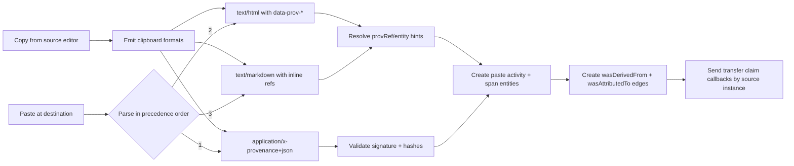
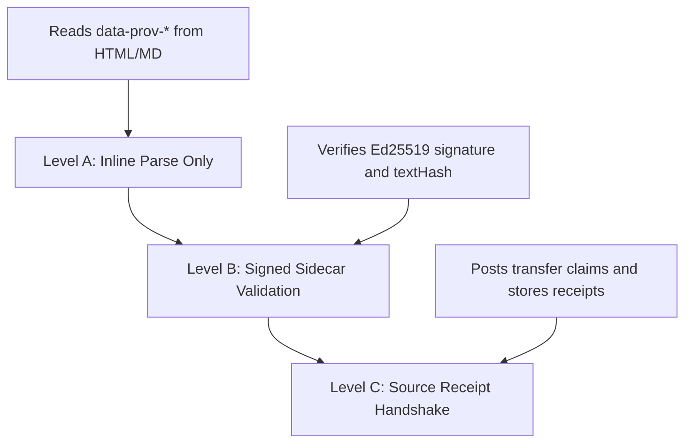
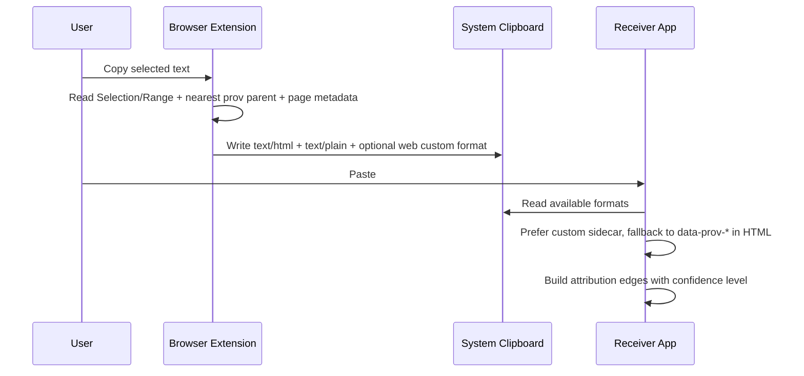

# Copy Attribution from Markdown/HTML

## Goal
Extend `spx-prov` so pasted HTML or Markdown can carry span-level references to provenance `entityId` values, even when full clipboard envelopes are not preserved end-to-end.

## Short answer
Yes. A practical approach is:
1. Keep `application/x-provenance+json` as the authoritative signed payload.
2. Add inline reference markers in HTML/Markdown (`data-prov-ref` / `data-prov-entity`).
3. Attach an annotation sidecar that maps those refs to `entityId`, `textHash`, and anchors.
4. Optionally serialize the sidecar using W3C Web Annotation compatible objects.

This gives robust fallback behavior without claiming that inline text prominence is cryptographically proven.

## Existing standards and what they cover

### 1. W3C Web Annotation (closest match for text-range annotations)
- `Web Annotation Data Model` is a W3C Recommendation and already defines interoperable selectors for text fragments.
- `TextQuoteSelector` (`exact`, `prefix`, `suffix`) and `TextPositionSelector` (`start`, `end`) closely match your anchor model.
- `Embedding Web Annotations in HTML` (W3C Note) describes embedding approaches with JSON-LD/RDFa/fragment identifiers.

Implication: use Web Annotation for selector semantics, while keeping `spx-prov` as the provenance and handshake layer.

### 2. HTML `data-*` attributes (best in-band carrier)
- WHATWG HTML standardizes `data-*` custom attributes for private application data.
- This is ideal for inline hints like `data-prov-entity="ent_..."`.

### 3. Clipboard standards
- W3C Clipboard API mandates `text/plain` and `text/html`, with optional custom formats.
- Browser custom formats (`"web " + mime`) are possible but not universal across all native apps.

Implication: treat custom MIME as best effort; keep `text/html` and Markdown-compatible hints as fallback.

### 4. Markdown reality
- `text/markdown` is a family of variants (RFC 7763), not one uniform syntax.
- CommonMark/GFM allow raw HTML passthrough, which makes inline `<span data-prov-...>` viable.
- Attribute-list syntax (`[text]{#id key=val}`) exists in ecosystems like Pandoc/Python-Markdown, but is not universal.

Implication: there is no single existing standard for provenance UID annotations in Markdown itself. A profile is needed.

## Proposed profile: `spx-prov` Markdown/HTML Annotation Profile (draft)

### 1. Concepts
- `provRef`: local fragment reference ID (`p1`, `p2`, ...), stable within one copied payload.
- `entityId`: canonical provenance UID from source graph.
- `annotation sidecar`: machine-readable map `provRef -> provenance metadata`.
- `evidence level`: `inline_hint | signed_bundle | acknowledged_receipt`.

### 2. Normative precedence on paste
1. Parse `application/x-provenance+json` (authoritative).
2. Parse `text/html` inline markers (`data-prov-*`).
3. Parse Markdown inline markers (raw HTML span and/or variant-specific attributes).
4. If unresolved, prompt for user attribution.

### 3. Inline carrier format

#### HTML (recommended)
```html
<span
  data-prov-ref="p1"
  data-prov-entity="ent_span_A1"
  data-prov-source="https://writer.example"
  data-prov-hash="sha256:abc..."
>
  Quoted sentence A.
</span>
```

Minimum fields:
- `data-prov-ref`
- one of `data-prov-entity` or resolvable sidecar ref

#### Markdown (portable baseline)
Use raw HTML spans, which survive CommonMark/GFM pipelines that allow inline HTML:
```md
<span data-prov-ref="p1" data-prov-entity="ent_span_A1">Quoted sentence A.</span>
```

#### Markdown (optional variant extension)
For Pandoc/Python-Markdown-style attribute lists:
```md
[Quoted sentence A.]{#p1 data-prov-entity="ent_span_A1"}
```

### 4. Annotation sidecar
Keep your existing clipboard envelope as the canonical sidecar. Add optional `annotations` for HTML/Markdown references:

```json
{
  "protocol": "spx-prov",
  "version": "0.1",
  "bundleId": "01J...",
  "segments": [
    {
      "segmentId": "seg_1",
      "provRef": "p1",
      "entityId": "ent_span_A1",
      "text": "Quoted sentence A.",
      "textHash": "sha256:abc...",
      "anchor": {
        "start": {"offset": 120, "leftContextHash": "sha256:...", "rightContextHash": "sha256:..."},
        "end": {"offset": 138, "leftContextHash": "sha256:...", "rightContextHash": "sha256:..."}
      }
    }
  ],
  "signature": {
    "alg": "Ed25519",
    "kid": "did:key:z...#instance-key-1",
    "sig": "base64..."
  }
}
```

Optional Web Annotation-compatible projection for interop:
- `target.selector`: `TextQuoteSelector` + `TextPositionSelector`
- `body`: pointer containing `entityId` and source instance URI

## Processing model



## Trust and "prominence" caveat
Inline annotations only prove that markup claims a reference. They do not prove original display prominence or editorial intent. Treat them as hints until corroborated by signed bundle and (optionally) source receipt.

Suggested evidence policy:
- `signed_bundle`: high confidence
- `inline_hint` only: low confidence, user-visible warning
- `signed_bundle + accepted receipt`: strongest confidence for cross-instance transfer

## Interop levels for this extension



- Level A: preserve attribution hints locally.
- Level B: import only when sidecar verifies.
- Level C: full bidirectional acknowledgement.

## Suggested protocol delta for `protocol_draft_1.md` (future v0.2)
1. Add section `Markdown/HTML Annotation Profile`.
2. Add `provRef` to segment schema.
3. Define `data-prov-ref` and `data-prov-entity` as reserved inline attributes.
4. Define parser precedence (`x-provenance+json` > HTML > Markdown > prompt).
5. Add conformance tests:
   - HTML-only paste with `data-prov-*`
   - Markdown raw HTML span paste
   - attribute-list variant paste
   - mismatched inline entity vs signed sidecar (must trust sidecar)
   - inline-only hints without signature (must mark low confidence)

## References
- Web Annotation Data Model (W3C Recommendation): https://www.w3.org/TR/annotation-model/
- Embedding Web Annotations in HTML (W3C Working Group Note): https://www.w3.org/TR/annotation-html/
- Web Annotation Protocol (W3C Recommendation): https://www.w3.org/TR/annotation-protocol/
- HTML Standard `data-*` attributes: https://html.spec.whatwg.org/multipage/dom.html#embedding-custom-non-visible-data-with-the-data-attributes
- Clipboard API and Events: https://www.w3.org/TR/clipboard-apis/
- RFC 7763 `text/markdown` media type: https://www.rfc-editor.org/rfc/rfc7763
- CommonMark raw HTML behavior: https://spec.commonmark.org/0.30/
- GitHub Flavored Markdown spec (raw HTML + filtering rules): https://github.github.io/gfm/
- Pandoc `bracketed_spans` extension (non-universal Markdown extension): https://pandoc.org/MANUAL.html#extension-bracketed_spans

## Follow-up Q&A (2026-02-28)

### Q1. Would it help if browsers populated clipboard metadata about the parent span and page/header attributes?
Yes, this would help materially.

Why:
- It would improve attribution recovery when custom MIME sidecars are dropped.
- It would make source context (nearest annotated parent, page URL/title/base) easier to preserve across heterogeneous paste targets.
- It would reduce ambiguity for receiver-side matching (`provRef -> entityId`) when only `text/html` survives.

Important caveat:
- This still would not prove prominence or editorial intent; it is still metadata asserted at copy-time unless backed by signed claims/receipts.

### Q2. Does a standard already exist for this exact metadata?
Not as a cross-browser web standard for provenance-specific fields.

What exists today:
- W3C Clipboard API defines transport/data-type behavior (`text/plain`, `text/html`, `image/png`, optional `"web "` custom formats), but not a standard schema for "selected parent span provenance metadata".
- Windows `CF_HTML` defines fragment/selection offsets and optional HTML context that can include surrounding tags and optional `<head>` elements (`<base>`, `<title>`), but this is an OS clipboard format, not a web provenance schema.

Inference: there is no universal, interoperable standard field set for provenance UIDs + ancestor-span metadata on clipboard copy.

### Q3. Could a browser extension demonstrate this as a POC?
Yes. A browser extension is a good POC path.

Recommended POC behavior:
1. On `copy`, inspect `Selection`/`Range` and resolve nearest ancestor carrying provenance attributes (for example, `data-prov-entity`).
2. Collect page-level metadata (`location.href`, `document.title`, optional `<meta>` values).
3. Write:
   - `text/html` with inline `data-prov-*` markers.
   - `text/plain` fallback.
   - optional custom format (`web application/x-provenance+json`) when supported.
4. On paste into the demo receiver app, apply precedence:
   - custom sidecar -> HTML markers -> heuristics.



Practical limits of the extension POC:
- Works only on pages where extension/content script has access.
- Custom clipboard formats are not guaranteed to survive into non-cooperating native apps.
- Some destinations sanitize HTML and may strip `data-*` attributes.
